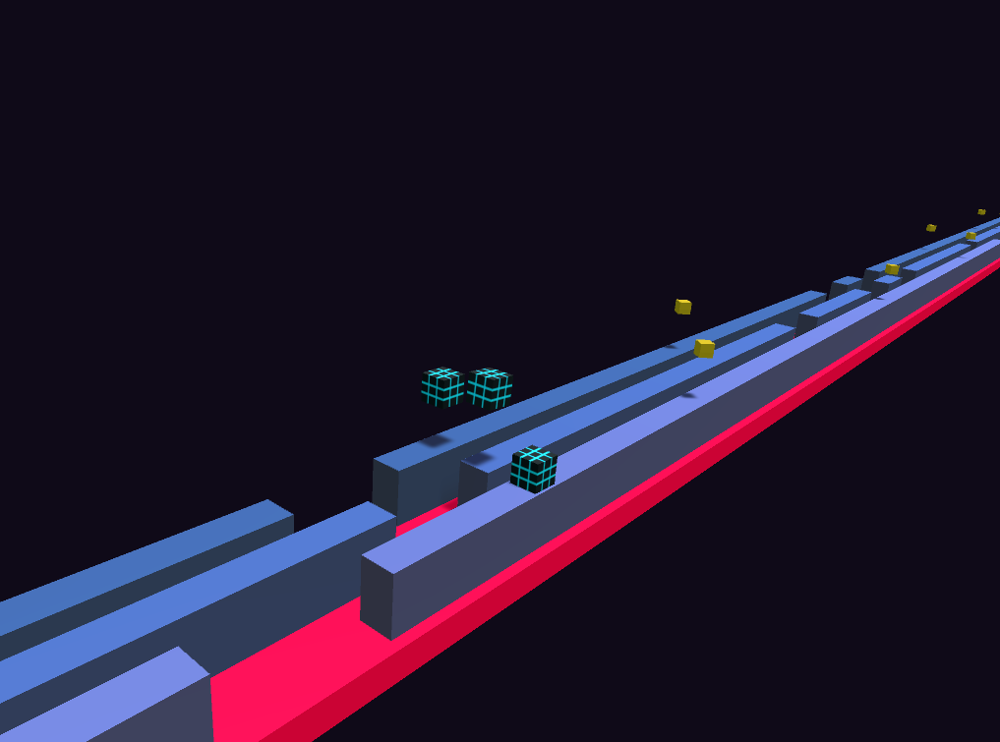

# Example Learning Environments

### About Example Environments
Unity ML Agents currently contains three example environments which demonstrate various features of the platform. In the coming months more will be added. We are also actively open to adding community contributed environments as examples, as long as they are small, simple, demonstrate a unique feature of the platform, and provide a unique non-trivial challenge to modern RL algorithms. Feel free to submit these environments with a Pull-Request explaining the nature of the environment and task. 

Environments are located in `unity-environment/ML-Agents/Examples`.

## 3DBall

* Set-up: A balance-ball task, where the agent controls the platform. 
* Goal: The agent must balance the platform in order to keep the ball on it for as long as possible.
* Agents: The environment contains 12 agents of the same kind, all linked to a single brain.
* Agent Reward Function: 
    * +0.1 for every step the ball remains on the platform. 
    * -1.0 if the ball falls from the platform.
* Brains: One brain with the following state/action space.
    * State space: (Continuous) 8 variables corresponding to rotation of platform, and position, rotation, and velocity of ball.
    * Action space: (Continuous) Size of 2, with one value corresponding to X-rotation, and the other to Z-rotation.
    * Observations: 0
* Reset Parameters: None

## GridWorld

* Set-up: A version of the classic grid-world task. Scene contains agent, goal, and obstacles. 
* Goal: The agent must navigate the grid to the goal while avoiding the obstacles.
* Agents: The environment contains one agent linked to a single brain.
* Agent Reward Function: 
    * -0.01 for every step.
    * +1.0 if the agent navigates to the goal position of the grid (episode ends).
    * -1.0 if the agent navigates to an obstacle (episode ends).
* Brains: One brain with the following state/action space.
    * State space: (Continuous) 6 variables corresponding to position of agent and nearest goal and obstacle.
    * Action space: (Discrete) Size of 4, corresponding to movement in cardinal directions.
    * Observations: One corresponding to top-down view of GridWorld.
* Reset Parameters: Three, corresponding to grid size, number of obstacles, and number of goals.

## Tennis

* Set-up: Two-player game where agents control rackets to bounce ball over a net. 
* Goal: The agents must bounce ball between one another while not dropping or sending ball out of bounds.
* Agents: The environment contains two agent linked to a single brain.
* Agent Reward Function (independent): 
    * -0.1 To last agent to hit ball before going out of bounds or hitting ground/net (episode ends).
    * +0.1 To agent when hitting ball after ball was hit by the other agent. 
    * +0.1 To agent who didn't hit ball last when ball hits ground.
* Brains: One brain with the following state/action space.
    * State space: (Continuous) 8 variables corresponding to position and velocity of ball and racket.
    * Action space: (Discrete) Size of 4, corresponding to movement toward net, away from net, jumping, and no-movement.
    * Observations: None
* Reset Parameters: One, corresponding to size of ball.

## Runner

* Set-up: A classic runner where the agent needs to jump through a series of obstacles. 
* Goal: The agent must survive as long as possible while avoiding the obstacles and collect bonuses.
* Agents: The environment contains multiple agents linked to a single brain.
* Agent Reward Function: 
* +0.005 for every step on the floor.
* +1.0 if the agent collect a bonus.
* +1.0 if the agent finish all sequences (depending on maxStep).
* -1.0 if the agent fall in a kill zone
* Brains: One brain with the following state/action space.
* State space: (Continuous) 6 variables corresponding to nearest obstacle positions, nearest bonus and ground.
* Action space: (Discrete) Size of 2, corresponding to idle or jump.
* Observations: 0.
* Reset Parameters: None

