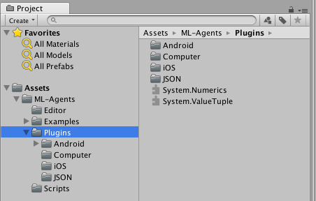
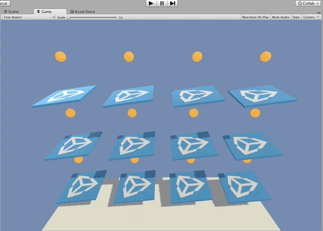
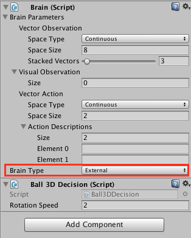
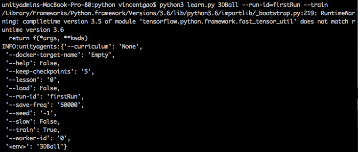

# 基礎編

こちらでは、pretrainedモデルをサンプルとして作成をしてある環境で使用する方法の説明と、モデルの作成の仕方を説明していきます。

もし、Unityの使い方を再度参照されたい方は、こちらをご覧ください。  
- [Unity Engine](https://unity3d.com/unity)  
- [Roll-a-ball tutorial](https://unity3d.com/learn/tutorials/s/roll-ball-tutorial) 

## ML-Agents Toolkitの簡単なセットアップをUnity上で行う

ML-AgentsをUnityで使用するためには少々環境の修正を行う必要がございます。
また、[TensorFlowSharp plugin](https://s3.amazonaws.com/unity-ml-agents/0.4/TFSharpPlugin.unitypackage)を今後のモデルトレーニングの際に使用をしていきますので、 
もし心配であれば、再度こちらのgit repoを参照ください。  
[TensorFlowSharp repo](https://github.com/migueldeicaza/TensorFlowSharp). 

では、早速先ほど述べた環境設定の変更を行いますので、下記の手順を追っていってください。
1. Unityを立ち上げる
2. Project Dialogにおいて、**Open**の部分を画面最上部のメニューから選択する
3. File選択の画面が出たのち、`unity-environment`のフォルダーを選択する。
4. 右記のように移動してください。 **Edit** > **Project Settings** > **Player** > **Other Settings** > **Configuration** > **Scripting Runtime Version** 
5. **Experimental (.NET 4.6 Equivalent or .NET 4.x Equivalent)** を選択する
6. **Scripting Defined Symbols**の項目で、`ENABLE_TENSORFLOW`に書き換える。 
7. ProjectをSaveする。  

完成後には下記の図のようになっているはずです。  

8. [Download](https://s3.amazonaws.com/unity-ml-agents/0.4/TFSharpPlugin.unitypackage) TensorFlowSharp plugin. 
9. 先ほど入手したTFSharpPlugin.unitypackageこちらのファイルをダブルクッリクして、現在開いているUnityのProjectにImportをしてください。 
10. Importが完了したら、一旦右記のフォルダーを確認して、きちんとImportができているのかを確認しましょう。  **Assets** > **ML-Agents** > **Plugins** > **Computer**.   

**Note**: もしimportされていなければ、直接ドラッグ&ドロップで、`ml-agents/unity-environment/Assets/ML-Agents`フォルダーを**Assets**配下にImportしてください。

現段階で下記の図のようなフォルダー構成になっていることを確認してください。  

## Pre-trained Modelの実行

ここから、下記の手順に従い、我々が配布しているpretrained Modelを実行してみましょう。
1. `Assets/ML-Agents/Examples/3DBall`フォルダーから`3DBall`のscene fileを選択してください。 
2. **Hierarchy** windowより、**Ball3DAcademy**配下の**Ball3DBrain**のGameObjectを選択して、Inspector windowをご覧ください。
3. **Ball3DBrain** objectの **Brain** componentを確認して、**Brain Type** を **Internal**へとセットしてください。
4. **Project** windowより`Assets/ML-Agents/Examples/3DBall/TFModels` folderの項目を開いてください。
5. `TFModels` folderに入っている、`3DBall` model file をドラッグ&ドロップで**Ball3DBrain** object の **Brain** componentにある**Graph Model** fieldにセットをしてください・
5. **Play** buttonをクリックすると、Gameが開始して各エージェントが先ほどセットをしたPretrained Modelをもとに行動をしていきます。

## Basics Jupyter Notebookを使ってみましょう

`python/Basics` [Jupyter notebook](Background-Jupyter.md)はPython APIの使い方を説明しているものとなり、こちらを一度ご覧いただくと今後の理解が捗ると思います。
また、こちらに入っているコードを使い簡単な環境のテストを行うこともできます。その際には`env_name`を ゲームユニットの名前と合わせるようにしてください。
ゲームユニットの作り方はこちらです。  
[use an executable](Learning-Environment-Executable.md)   
また、`env_name`を`None`にした場合は、Unityで開いているSceneの方が対象環境と認識されます。  

追加情報に関してはこちらを参照ください・  
[Python API](Python-API.md)

## Reinforcement Learningを使用してBrainをトレーニングしましょう
### BrainをExternalにセットしましょう
これまで、我々はPretrained Modelを使用してきました。その際にはBrainのコマンドを決定する主体は先ほどのPretrained Modelなので、内部に内包されている形でした。
ですので、Brain typeが Internal出会ったのです。
しかし、ここからは、このページてみたように、`jupyter Notebook`を使用したり、後ほど紹介する`learn.py`などを用いて、Unityをは別に動いているプロセスである、pythonからのコマンドを受け取って、
Agentsを動かして胃トレーニングを進めていきます。
よって、Brain typeの方を **External**に切り替えてください。

### Training the environment
これだけで準備は完了です。実際にPythonのスクリプトを動かして、Trainingを進めていきましょう。
1. Terminal/CMDを開いてください。 
2. ML-Agentsのgithub repo配下のpythonのフォルダーに移動してください。`./ml-agent/pythonpython`  
4. Run `python3 learn.py --run-id=<run-identifier> --train`
詳細:
- `<run-identifier>` : トレーニングの名称。この名前がトレーニング終了後にmodelやそのトレーニングの詳細を含むフォルダーを形成する。
- `--train` : このフラグにより、トレーニングであることを明示する。
5. _"Start training by pressing the Play button in the Unity Editor"_ が表示されたら、Unity上からGameを起動してください。
これでトレーニングが始まります。

**Note**: また、前述のExecutableという、buildされた単体のGameからも同様の Interfaceでトレーニングを行なっていくことができます。詳細は下記になります。  
 [this page](Learning-Environment-Executable.md)

`learn.py`が正常に起動をすると、下記の画面が見えるはずです。

### After training
トレーニングについては、いつでもストップをすることができます。ctrl+cか、UnityのGameを直接止めることができます。  
トレーニング終了後、`ml-agents/python/models/<run-identifier>/editor_<academy_name>_<run-identifier>.bytes` というファイルが生成されます。  
`<academy_name>` については、皆様のSceneで使われている名前が採用されます。  
これでついに、さきほどおこなったPretrained Modelと同じ手順で、今回生成したモデルを使用して、Agentsを動かしていくことができます。  
[Pretrained Modelの使い方詳細](#play-an-example-environment-using-pretrained-model).  

1. `ml-agents/python/models/<run-identifier>/editor_<academy_name>_<run-identifier>.bytes`を`unity-environment/Assets/ML-Agents/Examples/3DBall/TFModels/`配下に格納してください。
2. Unityから**3DBall** sceneを選んでください。
3. **Ball3DBrain** object を選びます。
4. **Type of Brain** を **Internal**に変更しましょう。
5. `<env_name>_<run-identifier>.bytes` file をドラッグ&ドロップで **Brain** にセットしましょう。
6. Playボタンを押してみましょう。
これで、先ほど作成したmodelを実際のAgentsに適用をすることができました。

## Next Steps

* For more information on the ML-Agents toolkit, in addition to helpful background, check out the [ML-Agents Toolkit Overview](ML-Agents-Overview.md) page.
* For a more detailed walk-through of our 3D Balance Ball environment, check out the [Getting Started](Getting-Started-with-Balance-Ball.md) page.
* For a "Hello World" introduction to creating your own learning environment, check out the [Making a New Learning Environment](Learning-Environment-Create-New.md) page.
* For a series of Youtube video tutorials, checkout the [Machine Learning Agents PlayList](https://www.youtube.com/playlist?list=PLX2vGYjWbI0R08eWQkO7nQkGiicHAX7IX) page. 
