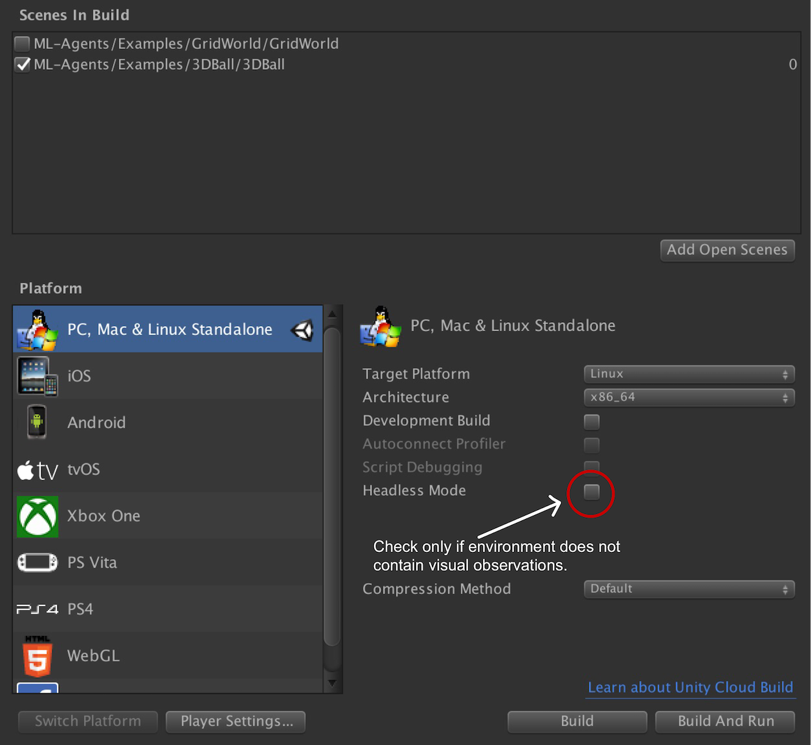

# DockerをML-Agentsに使う
我々は前回はWindows/Macにおいて、このレポジトリーを使う方を想定して説明しておりました。
ですので、今回のこの記事においてはPython/Tensorflow等のライブラリを直接インストールしたくない方に向けた記事となっております。
今回の記事では、GPUの使用は想定しておりません。ですので、[`Xvfb`](https://en.wikipedia.org/wiki/Xvfb)を使用して、グラフィックの部分を構築します。
`Xvfb`は`ML-Agents`仮想的なグラッフィクのアプリケーションをサポートする良いユーティリティです。ただ、前述の通り、`ML-Agents`がGPUを使用することを想定していないので、リッチなコンテンツの使用の際には幾分遅くなります。 

## 必要なもの

- Unity _Linux Build Support_ Component
- [Docker](https://www.docker.com)

## セットアップ

- Unity Installerを[Download](https://unity3d.com/get-unity/download)してく、_Linux Build Support_をコンポネントに追加してください。

- また、未設定であれば、Dockerを[Download](https://www.docker.com/community-edition#/download)とインストールしてください。

- Dockerはcontainerの上で動きます、host machineは異なる環境です。
mounted directoryは基本的にはデータの保管場所としてお使いください。例えば、the Unity executable, curriculum files and TensorFlow graphなどです。
また、利便性のために、我々は空の`unity-volume`directoryをrootに用意しました。ご自由にお使いください。 
しかし、ここから先のパートでは、`unity-volume` directoryを使っているものとして、進めていきます。

## 使用例

DockerをML-Agentsに使用するには３ステップあります。

1. Unity environmentをspecific flagsとともにビルドする。
2. Docker containerをビルドする。
3. Docker containerをランする。
Unity environmentをML-Agentsのためにビルドする方法が分からなければ、こちらをご覧ください。
[Getting Started with the 3D Balance Ball Example](Getting-Started-with-Balance-Ball.md)。

### Environmentをビルドする (オプショナル)
_基本的にはスキップしていただいて構いません。_

Since Docker typically runs a container sharing a (linux) kernel with the host machine, the 
Unity environment **has** to be built for the **linux platform**. When building a Unity environment, please select the following options from the the Build Settings window:
- Set the _Target Platform_ to `Linux`
- Set the _Architecture_ to `x86_64`
- If the environment does not contain visual observations, you can select the `headless` option here.

Then click `Build`, pick an environment name (e.g. `3DBall`) and set the output directory to `unity-volume`. After building, ensure that the file `<environment-name>.x86_64` and subdirectory `<environment-name>_Data/` are created under `unity-volume`.



### Docker Containerをビルドする

まず、Docker engineがランしていることを確認してください。
そして、Docker containerを下記のコマンドを実行してビルドしてください。


```
docker build -t <image-name> .
``` 
`<image-name>`をご自分のDocker imageの名前に置き換えてください。例：`balance.ball.v0.1`

**注意** もし、`trainer_config.yaml`に入っている、hyperparametersを変更したのであれば、Docker Containerを新しくビルドしてください。

### Run the Docker Container

Run the Docker container by calling the following command at the top-level of the repository:

```
docker run --name <container-name> \
           --mount type=bind,source="$(pwd)"/unity-volume,target=/unity-volume \
           -p 5005:5005 \
           <image-name>:latest <environment-name> \
           --docker-target-name=unity-volume \
           --train \
           --run-id=<run-id>
```

Notes on argument values:
- `<container-name>` is used to identify the container (in case you want to interrupt and terminate it). This is optional and Docker will generate a random name if this is not set. _Note that this must be unique for every run of a Docker image._
- `<image-name>` references the image name used when building the container.
- `<environemnt-name>` __(Optional)__: If you are training with a linux executable, this is the name of the executable. If you are training in the Editor, do not pass a `<environemnt-name>` argument and press the :arrow_forward: button in Unity when the message _"Start training by pressing the Play button in the Unity Editor"_ is displayed on the screen.
- `source`: Reference to the path in your host OS where you will store the Unity executable. 
- `target`: Tells Docker to mount the `source` path as a disk with this name. 
- `docker-target-name`: Tells the ML-Agents Python package what the name of the disk where it can read the Unity executable and store the graph. **This should therefore be identical to `target`.**
- `train`, `run-id`: ML-Agents arguments passed to `learn.py`. `train` trains the algorithm, `run-id` is used to tag each experiment with a unique identifier. 

To train with a `3DBall` environment executable, the command would be:

```
docker run --name 3DBallContainer.first.trial \
           --mount type=bind,source="$(pwd)"/unity-volume,target=/unity-volume \
           -p 5005:5005 \
           balance.ball.v0.1:latest 3DBall \
           --docker-target-name=unity-volume \
           --train \
           --run-id=3dball_first_trial
```

For more detail on Docker mounts, check out [these](https://docs.docker.com/storage/bind-mounts/) docs from Docker.


### Stopping Container and Saving State

If you are satisfied with the training progress, you can stop the Docker container while saving state by either using `Ctrl+C` or `⌘+C` (Mac) or by using the following command:

```
docker kill --signal=SIGINT <container-name>
```

`<container-name>` is the name of the container specified in the earlier `docker run` command. If you didn't specify one, you can find the randomly generated identifier by running `docker container ls`.
