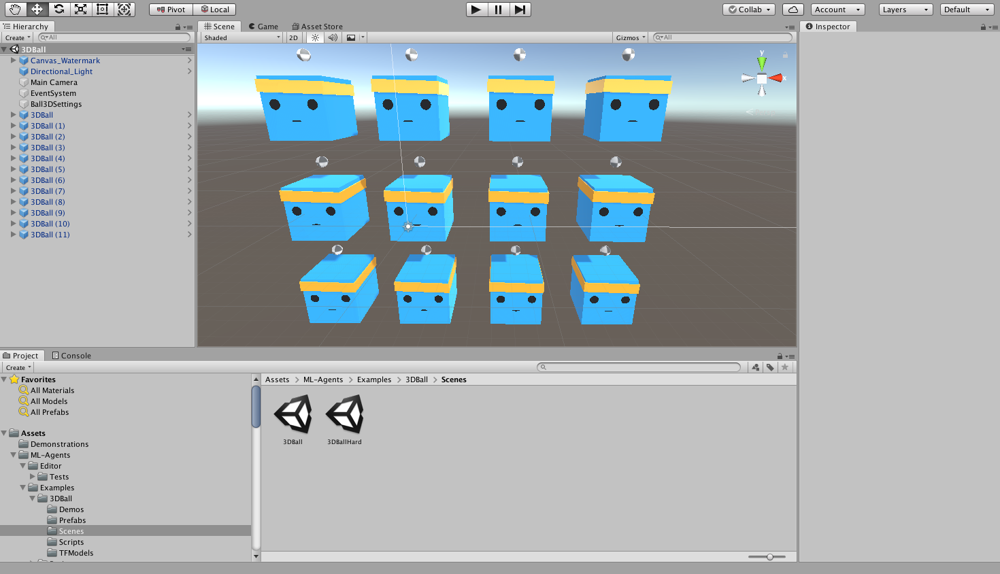

# 환경 실행 파일 사용하기

이 섹션은 환경과 상호 작용하기 위해 Editor 대신 빌드된 환경을 만들고 사용하는 데에 도움이 될 것입니다. 실행 파일을 사용하는 것은 편집기를 사용하는 것보다 몇 가지 이점이 있습니다.

- 전체 레포지토리를 공유하지 않고도 다른 사람과 실행 파일을 교환할 수 있습니다.
- 원격 컴퓨터에 실행 파일을 저장하여 더 빠른 훈련이 가능합니다.
- 더 빠른 훈련을 위해 `서버 빌드` (`헤드리스`) 모드를 사용할 수 있습니다. (단, 실행 파일이 렌더링을 요구하지 않는 한에서)
- 에이전트가 훈련하는 동안, 다른 작업에 대해 Unity Editor를 계속 사용할 수 있습니다.

## 3DBall 환경 구축하기

첫 번째 단계는 3D Balance Ball 환경이 포함된 Unity Scene을 여는 것입니다.

1. Unity를 실행합니다.
1. 프로젝트 대화 상자에서 창 상단의 **Open** 옵션을 선택합니다.
1. 파일 대화 상자를 사용하여, ML-Agents 프로젝트 내에서 `Project` 폴더를 찾은 후 **Open**을 클릭합니다.
1. **Project** 창에서 `Assets/ML-Agents/Examples/3DBall/Scenes/` 폴더로 이동합니다.
1. `3DBall` 파일을 두 번 클릭하여, 밸런스 볼 환경이 포함된 Scene을 로드합니다.



다음으로, 훈련 프로세스가 환경 실행 파일을 실행할 때 설정 장면이 올바르게 재생되어야 하는데, 이는 다음을 의미합니다.

- 환경 애플리케이션은 백그라운드에서 실행됩니다.
- 대화 상자에 상호 작용이 필요하지 않습니다.
- 올바른 Scene이 자동으로 로드됩니다.

1. 플레이어 설정 (메뉴: **Edit** → **Project Settings** → **Player**) 을 엽니다.
1. **해상도 및 프레젠테이션**에서:
   - **Run in Background**가 선택되어 있는지 확인합니다.
   - **Display Resolution Dialog**가 비활성화로 설정되어 있는지 확인합니다.  
(참고: 이 설정은 최신 버전의 Editor에서는 사용할 수 없습니다.)
1. Build Settings 창 (메뉴: **File** → **Build Settings**) 을 엽니다.
1. 대상 플랫폼을 선택합니다.
   - (선택사항) [디버깅 메시지 기록](https://docs.unity3d.com/Manual/LogFiles.html)을 선택하려면 “Development Build”를 선택합니다.
1. **Scenes in Build** 목록에 Scene이 표시되면 3DBall Scene만 선택되었는지 확인합니다.  
(리스트가 비어 있으면 현재 Scene만 빌드에 포함됩니다.)
1. **Build**를 클릭합니다.
   - 파일 대화상자에서 ML-Agents 디렉토리로 이동합니다.
   - 파일 이름을 할당하고 **Save**를 클릭합니다.
   - (Windows의 경우) Unity 2018.1에서는, 파일 이름 대신 폴더를 선택하라는 메시지가 표시됩니다. 루트 디렉토리 내에 하위 폴더를 만들고 작성할 폴더를 선택합니다. 다음 단계에서는 이 하위 폴더의 이름을 `env_name`이라고 합니다. Asset 폴더에는 빌드를 만들 수 없습니다.


이제 시뮬레이션 환경을 포함하는 Unity 실행 파일이 생겼으므로, 이와 상호작용 할 수 있습니다.

## 환경과 상호작용하기

실행 파일과 상호 작용하기 위해 [Python API](Python-LLAPI.md) 를 사용하고 싶다면, `UnityEnvironment`의 인수 `file_name`과 함께 실행 파일의 이름을 입력하면 된다. 예를 들어:

```python
from mlagents_envs.environment import UnityEnvironment
env = UnityEnvironment(file_name=<env_name>)
```

## 환경 교육하기

1. 명령 프롬프트 또는 터미널 창을 엽니다.
1. ML-Agents Toolkit을 설치한 폴더로 이동합니다. 기본 [설치]를 따랐을 경우, `ml-agents/`폴더로 이동합니다.
1. `mlagents-learn <trainer-config-file> --env=<env_name> --run-id=<run-identifier>` 명령어를 실행합니다.
	- `<trainer-config-file>`은 훈련 구성 yaml 파일의 경로입니다.
	- `<env_name>`은 Unity에서 내보낸 실행 파일의 이름 및 경로입니다. (확장자 없음)
	- `<run-identifier>`은 서로 다른 훈련 실행의 결과를 구분하는 데에 사용되는 문자열입니다.

예를 들어, 3DBall 실행 파일을 통해 훈련했고, ML-Agents Toolkit을 설치한 디렉토리에 이를 저장한 경우 다음을 실행합니다.

```sh
mlagents-learn config/ppo/3DBall.yaml --env=3DBall --run-id=firstRun
```

그러면 다음과 같은 것을 볼 수 있습니다.

```console
ml-agents$ mlagents-learn config/ppo/3DBall.yaml --env=3DBall --run-id=first-run


                        ▄▄▄▓▓▓▓
                   ╓▓▓▓▓▓▓█▓▓▓▓▓
              ,▄▄▄m▀▀▀'  ,▓▓▓▀▓▓▄                           ▓▓▓  ▓▓▌
            ▄▓▓▓▀'      ▄▓▓▀  ▓▓▓      ▄▄     ▄▄ ,▄▄ ▄▄▄▄   ,▄▄ ▄▓▓▌▄ ▄▄▄    ,▄▄
          ▄▓▓▓▀        ▄▓▓▀   ▐▓▓▌     ▓▓▌   ▐▓▓ ▐▓▓▓▀▀▀▓▓▌ ▓▓▓ ▀▓▓▌▀ ^▓▓▌  ╒▓▓▌
        ▄▓▓▓▓▓▄▄▄▄▄▄▄▄▓▓▓      ▓▀      ▓▓▌   ▐▓▓ ▐▓▓    ▓▓▓ ▓▓▓  ▓▓▌   ▐▓▓▄ ▓▓▌
        ▀▓▓▓▓▀▀▀▀▀▀▀▀▀▀▓▓▄     ▓▓      ▓▓▌   ▐▓▓ ▐▓▓    ▓▓▓ ▓▓▓  ▓▓▌    ▐▓▓▐▓▓
          ^█▓▓▓        ▀▓▓▄   ▐▓▓▌     ▓▓▓▓▄▓▓▓▓ ▐▓▓    ▓▓▓ ▓▓▓  ▓▓▓▄    ▓▓▓▓`
            '▀▓▓▓▄      ^▓▓▓  ▓▓▓       └▀▀▀▀ ▀▀ ^▀▀    `▀▀ `▀▀   '▀▀    ▐▓▓▌
               ▀▀▀▀▓▄▄▄   ▓▓▓▓▓▓,                                      ▓▓▓▓▀
                   `▀█▓▓▓▓▓▓▓▓▓▌
                        ¬`▀▀▀█▓

```

**참고:** Anaconda를 사용하는 경우, 먼저 ML-Agents 환경을 활성화하는 것을 잊지 마세요.

`mlagents-learn` 명령어가 올바르게 실행됐고, 훈련을 시작하면 다음과 같은 내용이 표시됩니다.

```console
CrashReporter: initialized
Mono path[0] = '/Users/dericp/workspace/ml-agents/3DBall.app/Contents/Resources/Data/Managed'
Mono config path = '/Users/dericp/workspace/ml-agents/3DBall.app/Contents/MonoBleedingEdge/etc'
INFO:mlagents_envs:
'Ball3DAcademy' started successfully!
Unity Academy name: Ball3DAcademy

INFO:mlagents_envs:Connected new brain:
Unity brain name: Ball3DLearning
        Number of Visual Observations (per agent): 0
        Vector Observation space size (per agent): 8
        Number of stacked Vector Observation: 1
INFO:mlagents_envs:Hyperparameters for the PPO Trainer of brain Ball3DLearning:
        batch_size:          64
        beta:                0.001
        buffer_size:         12000
        epsilon:             0.2
        gamma:               0.995
        hidden_units:        128
        lambd:               0.99
        learning_rate:       0.0003
        max_steps:           5.0e4
        normalize:           True
        num_epoch:           3
        num_layers:          2
        time_horizon:        1000
        sequence_length:     64
        summary_freq:        1000
        use_recurrent:       False
        memory_size:         256
        use_curiosity:       False
        curiosity_strength:  0.01
        curiosity_enc_size:  128
        output_path: ./results/first-run-0/Ball3DLearning
INFO:mlagents.trainers: first-run-0: Ball3DLearning: Step: 1000. Mean Reward: 1.242. Std of Reward: 0.746. Training.
INFO:mlagents.trainers: first-run-0: Ball3DLearning: Step: 2000. Mean Reward: 1.319. Std of Reward: 0.693. Training.
INFO:mlagents.trainers: first-run-0: Ball3DLearning: Step: 3000. Mean Reward: 1.804. Std of Reward: 1.056. Training.
INFO:mlagents.trainers: first-run-0: Ball3DLearning: Step: 4000. Mean Reward: 2.151. Std of Reward: 1.432. Training.
INFO:mlagents.trainers: first-run-0: Ball3DLearning: Step: 5000. Mean Reward: 3.175. Std of Reward: 2.250. Training.
INFO:mlagents.trainers: first-run-0: Ball3DLearning: Step: 6000. Mean Reward: 4.898. Std of Reward: 4.019. Training.
INFO:mlagents.trainers: first-run-0: Ball3DLearning: Step: 7000. Mean Reward: 6.716. Std of Reward: 5.125. Training.
INFO:mlagents.trainers: first-run-0: Ball3DLearning: Step: 8000. Mean Reward: 12.124. Std of Reward: 11.929. Training.
INFO:mlagents.trainers: first-run-0: Ball3DLearning: Step: 9000. Mean Reward: 18.151. Std of Reward: 16.871. Training.
INFO:mlagents.trainers: first-run-0: Ball3DLearning: Step: 10000. Mean Reward: 27.284. Std of Reward: 28.667. Training.
```

`Ctrl+C`를 눌러 훈련을 중지하면, 훈련된 모델이 해당 모델의 최신 체크포인트에 해당하는 `results/<run-identifier>/<behavior_name>.onnx`에 있을 것입니다. (**참고:** Windows에서 알려진 버그로 인해 훈련을 조기 종료할 때 모델 저장을 실패합니다. Step이 Config YAML에서 설정한 max_steps 파라미터에 도달할 때까지 기다리는 것이 좋습니다.) 이제 아래의 단계에 따라 이 훈련된 모델을 에이전트에 임베드할 수 있습니다.

1. 모델 파일을 `Project/Assets/ML-Agents/Examples/3DBall/TFModels/`로 이동시킵니다.
1. Unity Editor를 열고, 위에서 설명한 대로 **3DBall** Scene을 선택합니다.
1. Project 창에서 **3DBall** 프리팹을 선택하고, **Agent**를 선택합니다.
1. Editor의 프로젝트 창에서 `<behavior_name>.onnx` 파일을 인스펙터 창의 **Ball3DAgent**의 플레이스 홀더로 드래그-드롭 합니다.
1. **Play** 버튼을 누릅니다.

## 헤드리스 서버를 통해 훈련하기

그래픽 렌더링을 지원하지 않는 헤드리스 서버에서 훈련을 실행하려면, Unity 실행 파일에서 그래픽 표시를 해제해야 합니다. 이를 위한 두 가지 방법이 있습니다.
1. mlagents-learn 명령에 `—no-graphics` 옵션을 추가합니다. 이는 Unity 실행 파일의 명령줄에 `-nographics -batchmode`를 추가하는 것과 같습니다.
1. **서버 빌드**로 Unity 실행 파일을 구축하십시오. 이 설정은 Unity Editor의 빌드 설정에서 찾을 수 있습니다.

카메라나 시각적 관찰을 사용하여 그래픽을 훈련시키려면 서버 시스템에서 디스플레이 렌더링 지원 (예: xvfb) 을 설정해야 합니다. [Colab Notebook Tutorials](https://github.com/Unity-Technologies/ml-agents/blob/develop/docs/ML-Agents-Toolkit-Documentation.md#python-tutorial-with-google-colab)의 설정 섹션에, 서버에 xvfb를 설정하는 예시가 나와 있습니다.
